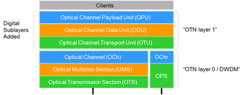

# Advanced Topics: Optical Transport Network and Zigbee
## Author: Qingran Shao

## introduce:
The development of Optical Transport Network (OTN) and Zigbee technologies is driven by specific industry trends and needs. These innovations play a crucial role in addressing high-priority applications and problems within the software industry, enhancing data transmission capabilities, and supporting the growing landscape of the Internet of Things (IoT).

The Optical Transport Network (OTN) addresses the pressing needs for high-bandwidth, reliable long-distance data transmission in the software industry. With the rapid expansion of internet usage, video streaming, and cloud computing, traditional transmission technologies have become insufficient. OTN is essential for applications such as telecommunications, where telecom operators require OTN for its ability to handle massive data flows with minimal latency and high reliability. Data centers also rely on OTN to manage and transmit large volumes of data across extensive networks efficiently. In the financial services sector, high-speed, secure data transmission is critical for supporting real-time trading and data analytics. Additionally, the healthcare industry depends on OTN for reliable long-distance data transmission, crucial for telemedicine and the secure transfer of medical records. OTN supports ultra-high-speed data transfer using optical fiber, offers robust error detection and correction, and adapts to various network topologies, simplifying network management and maintenance. These features make OTN indispensable for industries where data integrity and speed are paramount.

Zigbee technology is pivotal in addressing the requirements for low-power, low-cost wireless communication within the IoT landscape. The proliferation of IoT devices in various sectors has highlighted the need for efficient communication technologies. Zigbee is crucial for applications such as home automation, where it enables smart home devices to communicate efficiently, ensuring low power consumption and extended battery life. In industrial automation, Zigbee supports the seamless operation of sensors and actuators, enhancing operational efficiency and reliability. The healthcare sector benefits from Zigbee's reliable, low-power data transmission in wearable health monitors and medical devices. In agriculture, Zigbee facilitates the operation of sensor networks for monitoring environmental conditions and optimizing agricultural practices. Zigbee is characterized by its low power consumption, cost-effective design, and ability to support self-healing mesh networks, making it ideal for short-range communication and large-scale deployment in diverse environments. These features address the critical need for efficient, reliable communication in IoT applications.

OTN and Zigbee are pivotal in their respective domains, with OTN facilitating high-speed, reliable long-distance data transmission and Zigbee enabling efficient, low-power, short-range wireless communication in IoT applications. Each technology has been designed to meet specific industry needs, contributing significantly to the advancement of their respective fields and addressing high-priority applications and problems within the software industry.

## Optical Transport Network
### OTN protocol
OTN is often referred to as a "digital wrapper" because it encapsulates each client or service transparently into a container for transport across optical networks, preserving the client's native structure, timing, and management information. This enhanced multiplexing capability allows OTN to carry different traffic types, including IP, Ethernet, storage, digital video, and SONET/SDH, over its framing structure, which is a key reason for its widespread adoption.

Since its inception in 2001, OTN has evolved beyond merely being a SONET/SDH wrapper. It has been optimized to support Ethernet, today's most popular client service, ranging from 1GE to 400GE. OTN-enabled technology is foundational for next-generation optical networks, supporting flexible packet technologies that include new Ethernet interfaces, Multi-Protocol Label Switching (MPLS), Segment Routing, and Time-Sensitive Networking (TSN). OTN technology has been extensively deployed worldwide, covering a wide spectrum of applications. Hundreds of thousands of OTN ports are now in operation, carrying mission-critical traffic from the network edge to the metro and core, as well as in submarine applications.

The OTN wrapper is made up of several components in a hierarchy as depicted in  Figure 1

The Optical Transport Module (OTM) is the information  structure transported across the optical interface. It has two parts: a digital  structure and an optical structure. The Optical Channel Payload Unit (OPU)  contains the payload frames. The payload area of the OPU structure is comprised  of end-user services such as IP, Ethernet, or any other protocol. The OPU  overhead is associated with the mapping of client data into the payload area. The  Optical Channel Data Unit (ODU) contains the OPU overhead and payload area,  plus additional overhead such as BIP8, GCC1/2, Tandem Connection Monitoring (TCM),  and so on. The ODU represents the OTN path service within an OTN network.

### Key Advantage
OTN (Optical Transport Network) has several primary advantages:

Backward Compatibility: OTN is fully backward compatible, meaning it can be built on existing SONET/SDH management functions. This not only ensures complete transparency for existing communication protocols but also provides end-to-end connectivity and networking capabilities for WDM (Wavelength Division Multiplexing). Additionally, OTN offers specifications for optical layer interconnection for ROADM and supplements sub-wavelength aggregation and grooming capabilities, establishing end-to-end links and networking capabilities primarily on the SDH basis while providing a model for the optical layer.

Comprehensive Network Coverage: The OTN concept encompasses both the optical and electrical network layers, inheriting the dual advantages of SDH and WDM. The key technical features are:

Various Client Signal Encapsulation and Transparent Transmission: The OTN frame structure, based on ITU-T G.709, supports the mapping and transparent transmission of various client signals such as SDH, ATM, and Ethernet. Standard encapsulation and transparent transmission can be achieved for SDH and ATM, although there are differences in support for different rates of Ethernet. ITU-T G.sup43 provides supplementary recommendations for varying degrees of transparent transmission for 10GE services, while standardized mapping methods into the OTN frame for GE, 40GE, 100GE Ethernet, Fiber Channel (FC) for private network services, and Gigabit Passive Optical Network (GPON) for access network services are still under discussion.

Large Granularity Bandwidth Multiplexing, Cross-Connection, and Configuration: The electrical layer bandwidth granularity defined by OTN is the Optical Channel Data Unit (ODUk, k=0,1,2,3), i.e., ODU0 (GE, 1 Gbps), ODU1 (2.5 Gbps), ODU2 (10 Gbps), and ODU3 (40 Gbps), with the optical layer's bandwidth granularity being the wavelength. Compared to SDH's VC-12/VC-4 scheduling granularity, OTN's multiplexing, cross-connection, and configuration granularity are significantly larger, greatly enhancing the adaptability and transmission efficiency for high-bandwidth data client services.

Robust Overhead and Maintenance Management Capabilities: OTN provides overhead management capabilities similar to SDH. The OTN frame structure at the Optical Channel (OCh) layer significantly enhances the digital monitoring capabilities of this layer. Additionally, OTN offers six levels of nested Tandem Connection Monitoring (TCM) functions, making it possible to perform end-to-end and multi-segment performance monitoring simultaneously during OTN networking, providing suitable management methods for cross-operator transmission.

Enhanced Networking and Protection Capabilities: With the introduction of OTN frame structures, ODUk cross-connection, and multi-dimensional reconfigurable optical add-drop multiplexers (ROADM), OTN significantly enhances networking capabilities. This changes the current state of bandwidth scheduling based on SDH VC-12/VC-4 and large-capacity transmission bandwidth provision by WDM point-to-point. The adoption of Forward Error Correction (FEC) technology significantly increases the transmission distance in the optical layer. Furthermore, OTN will offer more flexible service protection functions based on both the electrical and optical layers, such as Optical Channel Connection Protection (SNCP) and shared ring network protection based on the ODUk layer, and optical channel or multiplex section protection based on the optical layer. However, shared ring network technology has yet to be standardized.
